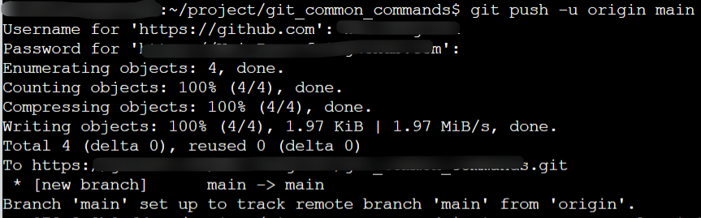
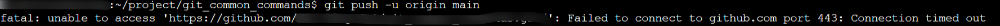

# git push 无响应

学习git命令后，我在Github上进行了实操，但是运行过程中出现了一些问题，在我第一次进行上传时一切正常

```
git push -u origin main
```



但是后续更改后想要再次push到GitHub上时卡住并出现超时



经过查阅博客发现是我的代理和GitHub代理的问题，只需要关掉其中任意一个代理即可

```git
#关闭GitHub代理
#取消http代理
git config --global --unset http.proxy
#取消https代理 
git config --global --unset https.proxy
```

再次提交一个成功！